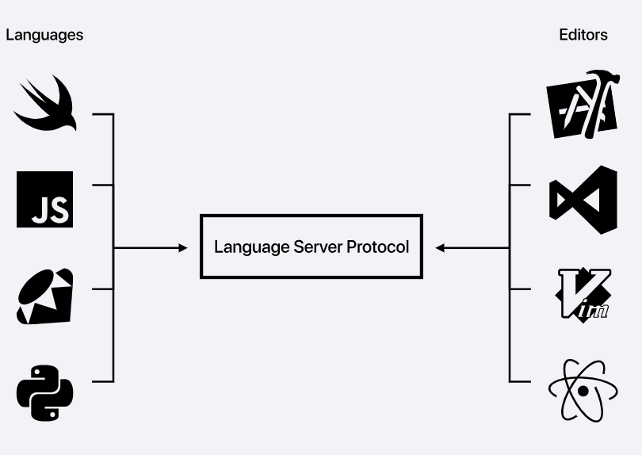
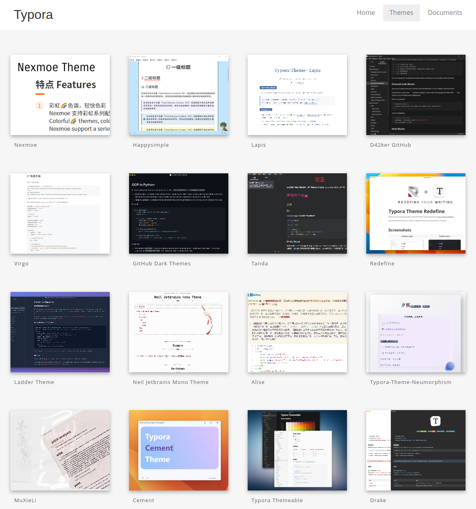
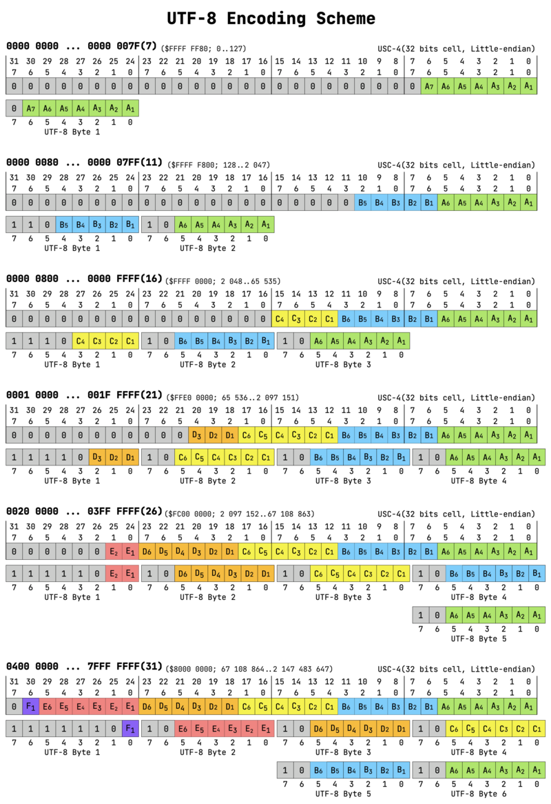
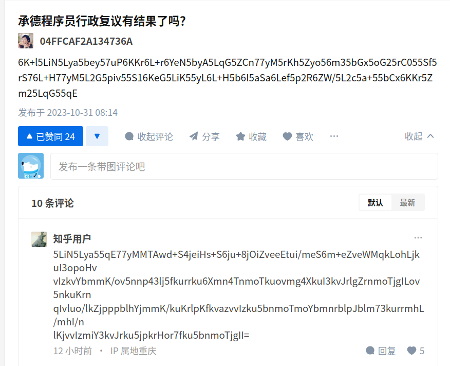

% 酒井科协基础技能培训 第二讲
% 李骋昊 
% 崇祯七甲辰九月庚子朔初十日己酉

---
CJKmainfont: Noto Sans Mono CJK TC
CJKoptions:
  - BoldFont=Noto Sans Mono CJK TC Bold
  - ItalicFont=Noto Sans CJK TC
---

----------------------------------------

# 基础概念：

环境变量、编译器、解释器、调试器、文本编辑器、IDE

------------------------------------------

## 环境变量

环境变量是一个在常见操作系统上都存在的概念。它是一系列字符串的键值对。可以在运行时拿到。

最常见的环境变量是「PATH」。PATH的作用是指定系统在执行命令或程序时，可以在哪些文件夹中查找。它的值是由多个文件夹路径组成的，用分号分隔。

- 这样才能在各种地方使用`g++`之类的命令！

在`bash`中， 用`$name`来访问名字是`name`的环境变量。例如，请尝试命令`echo $PATH`。

我们来做一点实验！（examples/env/）

------------------------------------------

怎样修改环境变量？

在 bash 或 zsh 中，可以通过刚才在实验中使用的`export name=value`来设置一个在当前shell中有效的环境变量。
如果你希望这个设定长久有效，请在`.bashrc` 或 `.zshrc` 中设定！

对于修改PATH（通常你期望是添一条）， 你可以在`.bashrc`的最后添上：

``` bash
#在2023-09-01 06:46安装的，system verilog 环境
export PATH="/home/lethe/tools/Xilinx/
Vivado/2019.2/bin:$PATH"
```
你可以认为，在这个文件中的脚本，相当于在每次开启终端时被执行一次。例如我们在`.bashrc`的最后添上一行`date`， 就会在每次打开终端时显示当前日期和时间。

对于 Windows, 请自行搜索如何在「高级系统设置」中设定环境变量！


------------------------------------------

## 编译器、解释器

什么是CPU能直接理解的？ 机器指令。（详见「计系概」等一系列课程）
什么是程序员能写的？ (汇编) C C++ Rust Go Python PHP TS Java Kotlin Haskell... 

对编译型语言，这中间的Gap，由编译器、汇编器、链接器填上。

\begin{tikzpicture}[node distance=10pt]
  \node[draw]                        (x0)  {a.cpp};
  \node[draw, below=20pt of x0]      (x1)  {汇编 .s 或 .asm};
  \node[draw, below=20pt of x1]      (x2)  {目标文件 .o 或 .obj};
  \node[draw, right=60pt of x0]      (y0)  {b.cpp};
  \node[draw, right=20pt of y0]      (w)   {b.h};
  \node[below=10pt of y0]            (tmp_b)  {};
  \node[draw, below=20pt of y0]      (y1)  {汇编 .s 或 .asm};
  \node[draw, below=20pt of y1]      (y2)  {目标文件 .o 或 .obj};
  \node[below=20pt of x2]             (tmp)  {};
  \node[draw, right=10pt of y2]      (z)    {静态链接库 .a 或 .lib};

  \node[draw, right=20pt of tmp]      (x3)  {可执行文件};
  \node[draw, below=20pt of x3]       (x4)  {运行};
  \node[draw, right=80pt of x4]      (z1)    {动态链接库 .so 或 .dll};


  \draw[->] (x0) -- node[left]  {编译器} (x1);
  \draw[->] (x1) -- node[left]  {汇编器} (x2);
  \draw[->] (y0) -- node[left]  {编译器} (y1);
  \draw[->] (y1) -- node[left]  {汇编器} (y2);
  \draw[->] (x2) -- node[left]  {链接器} (x3);
  \draw[->] (y2) -- node[left]  {链接器} (x3);
  \draw[->] (z) -- node[right]   {链接器} (x3);
  \draw[->] (x3) -- node[right]   {链接器} (x4);
  \draw[->] (z1) -- node[above]   {运行时动态加载} (x4);

  \draw[->] (w) -- (w|-tmp_b) -> node[above] {预处理}(tmp_b);

\end{tikzpicture}

g++ = 预处理器 + 编译器 + 汇编器 + 链接器

----------------------------------------

而对于python等解释型语言，典型的过程是：

\begin{tikzpicture}[node distance=10pt]
  \node[draw]                        (x0)  {a.py};
  \node[draw, below=20pt of x0]      (x1)  {解释器(可执行)};
  \node[draw, right=40pt of x1]      (x2)  {.so 或 .dll};

  \draw[->] (x0) -- node[right]   {} (x1);
  \draw[->] (x2) -- node[above]  {动态加载} (x1);


\end{tikzpicture}

现实世界是复杂的。对于java这种有「虚拟机」的语言, 既有「编译」，也有「解释」。

\begin{tikzpicture}[node distance=10pt]
  \node[draw]                        (java)  {.java};
  \node[draw, below=20pt of java]      (x0)  {.cls};
  \node[draw, below=20pt of x0]      (x1)  {Java Virtual Machine(JVM)};
  \node[draw, right=100pt of x1]      (x2)  {.so 或 .dll};

  \draw[->] (java) -- node[right]   {javac 编译器} (x0);
  \draw[->] (x0) -- node[right]   {} (x1);
  \draw[->] (x2) -- node[above]  {Java Native Interface} (x1);


\end{tikzpicture}


----------------------------------------


`g++` 和 `gcc`的主要区别：

- `g++` 把 `.c` 和 `.cpp` 都当作C++代码。`gcc` 把 `.c` 和 `.cpp` 分别当作C 和 C++代码。
- `g++` 默认连接 STL 标准库， 而 `gcc` 需要指定 `-lstdc++` 实现这一点。

简单来讲，当你在写 C++ 代码，如果不知道怎么选，用`g++`来编译。

----------------------------------------


include path:

查看 g++ 的 include 路径！ （g++ 去哪找 header）
```bash
echo | g++ -E -Wp,-v -
```

在`.vscode` 的 `c_cpp_properties.json`中设的include path
告诉LSP你include的东西在哪——不代表编译的时候有什么！


----------------------------------------

## 调试器

以[GDB](https://www.sourceware.org/gdb/)为例:

GDB can do four main kinds of things (plus other things in support of these) to help you catch bugs in the act:

- Start your program, specifying anything that might affect its behavior.

- Make your program stop on specified conditions.

- Examine what has happened, when your program has stopped.

- Change things in your program, so you can experiment with correcting the effects of one bug and go on to learn about another.

具体的用法远远超过了这六刻钟的课程能涵盖的。

但是请记住： 为了让`gdb`能在调试的时候显示变量名、代码， 必然要在可执行文件中保留这些对程序执行并不必要的信息。通过在使用`gcc 或 g++`编译时的`-g`选项来实现这一点！

----------------------------------------


# 文本编辑器 & IDE

文本编辑器： 处理纯文本文件 [+ 一大堆插件]。

常见：

- Visual Studio Code
- Vi Vim Nvim
- Nano
- Notepad++ 
- emacs


----------------------------------------------

IDE (Integrated Development Environment)。

= 文本编辑器 + 构建工具 + 调试器 + 编译器/解释器 

常见：

- Visual Studio 
- JetBrains: IDEA、Clion、Pycharm、Goland （更像编辑器？自身并不包含编译器/解释器）
- Eclipse
- Android Studio
- Vivado Design Suite (Integrated Synthesis Environment)
- Visual Basic
- Dev-C++

----------------------------------------------

# Why Vscode?


- 功能强大的编辑器！
- **Vscode Remote**
- 丰富的插件生态
  - 多人协作：
    - 对git等控制工具的支持 (git graph、 git blame)
  - 语言相关：
    - 代码补全、分析、代码补全、语法检查
    - 调试
  
  - Docker、Todo 、format、...


----------------------------------------------

# 「功能强大」的编辑器


## [multicursor](https://code.visualstudio.com/docs/editor/codebasics#_multiple-selections-multicursor)

`Alt` + 点击： 添加一个次级cursor
`Shift + Alt + Down` 或 `Shift + Alt + Up` 在上一行/下一行添加一个次级cursor
用`Esc`以退出

`Ctrl + D`: 选中当前单词 / 当前单词的下一次出现


## 整行操作

向下/上复制一行 `Ctrl + Shift + Alt + Down` 或 `Ctrl + Shift + Alt + Up`。

删除当前行 `Ctrl + Shift + K`。

如果不起作用，请`Ctrl + K Ctrl + S`查看相关设定, 自行解决冲突！

选中一行 `Ctrl + L`

光标移动到一行的开头 / 末尾 `Home` / `End` (Mac上似乎是`Ctrl + A` 和 `Ctrl + E`, which is Emacs ShortCut)

扩大 / 缩小 选中范围 `Shift + Alt + Left` / `Shift + Alt + Rihgt`

## 杂项

`Ctrl + Left` 往前跳一个单词
`Ctrl + Right` 往后跳一个单词


----------------------------------------------

作为一个轻量的编辑器
Vscode何以实现对众多(数十种)语言各种语言相关特性的支持？

----------------------------------------------

# 语言服务器：


[LSP协议](https://microsoft.github.io/language-server-protocol/)这样的中间层的思想，你会在网络原理、编译原理里面看到！



-------------------------------------------------


开发工具会将用户打开、修改、关闭文件、查询变量定义的信息通知语言服务器，
语言服务器将可能作出回复 / 提出Error 和 Warning. 

许多常见语言都有Language Server的[实现](https://microsoft.github.io/language-server-protocol/implementors/servers/)！

-------------------------------------------------

# [VSCode Debug Protocol](https://github.com/microsoft/vscode-debugadapter-node) 
以在VSCode中用gdb调试c++为例：

在 VSCode 中，与 gdb 的交互是通过 VSCode Debug Protocol 来实现的。具体来说，当你在 VSCode 中启动 C++ 调试器时，VSCode 的相关拓展 会启动一个 gdb 进程，并与其建立通信管道。VSCode 会向 gdb 发送命令，例如设置断点、继续执行等，然后接收 gdb 返回的响应。VSCode 还会解析 gdb 返回的信息，例如变量值、堆栈跟踪等，并将其显示在调试器 UI 中。这样就实现了 VSCode 和 gdb 的交互。

-------------------------------------------------

以下将以在Vscode中配置c++的开发环境为例：

我们希望：
- 能「一键」运行代码，即使其中涉及到多文件
- 能用vscode的图形界面来调试代码

Prerequisite:

安装方面，请参考[Doc9](https://docs.net9.org/basic/vscode/)。
通过适当的安装以及环境变量配置，你可以使用`g++` 和 `gdb` 命令！

请执行`g++ -v`和`gdb -v`来检查这一点。

为了在多文件上更方便一些，我这里使用了`make` 工具, （OOP课程会讲， 本课程没有时间讲了）
请以`make -v`检查一下是否安装正确。


-------------------------------------------------

Step 0:
  安装VScode。[官网](https://code.visualstudio.com/)。

Step 1:
  安装对应的 Vscode Extension： 
  C/C++ , C/C++ Extension Pack

Step 2:
  检查 make g++ gdb 指令是否正常

Step 3:
  在.vscode文件夹下创建tasks.json和launch.json，譬如，可以参考示例(注意修改launch.json中的调试器路径)

Step 4:
  vscode中进入打开的文件（多文件下，请和你在makefile文件或者在tasks.json中配置的保持一致），点击按钮以运行或调试！


-------------------------------------------------

显然，以上的过程中的关键在tasks.json和launch.json。

tasks.json用来控制文件的编译过程。launch.json用于启动debug。其中的联系在于，`launch.json`中的一条`configuration`中的`"preLaunchTask"`是对应的`task.json`中的一条`task`中的`label`！

你可以在`tasks.json`中控制编译的细节——譬如，加上什么宏，用什么编译选项，在多文件场合要用哪些文件。

- 这里，我选择用make来维护多文件时的场景。
- 因为``.vscode`对你的整个vscode打开的文件夹下生效，考虑如果你有多个编译的目标？
- 在目前[Doc9](https://docs.net9.org/basic/vscode/)的文档中使用的是在tasks.json中手写要包含的文件的方法。
  

你可以在`launch.json`控制运行时的细节——譬如，加上什么环境变量，用什么命令行参数。

具体请参考提供的示例！

大坑： `makefile`中的 shell 命令必须以一个`Tab`, 而不能是4个空格开头！


-------------------------------------------------

# Markdown

这篇文档以Markdown格式书写，借由pandoc由xelatex引擎生成此pdf。

# Why Markdown?

Idea : 专注内容而不是复杂的格式排版（e.g. 正确使用模板的Word / Latex）

1. 常见的轻量级标记语言
  - readme.md 知乎评论区
2. 应用广泛
  - 生成静态网站：  [Jekyll](https://jekyllrb.com/) [Hexo](https://hexo.io/zh-tw/index.html)
  - 笔记：[Obsidian](https://obsidian.md/), [Bear](https://bear.app/)
  - Slides: [Marp](https://marp.app/), [Remark](https://github.com/gnab/remark)
  - 文档： [MkDocs](https://www.mkdocs.org/) ([Doc9](https://docs.net9.org/notes/editor/))， [Read the Docs](https://about.readthedocs.com/?ref=readthedocs.com), [VuePress](https://vuepress.vuejs.org/)
  - 用来写作业


------------------------------------------------


# 基本语法

Markdown只是一种标记语言，具体如何呈现完全取决于你用什么「模板」。[Typora Gallery](https://theme.typora.io/)。



------------------------------------------------

## Heading

```markdown

# H1
## H2
### H3
#### H4
##### H5
###### H6

```
------------------------------------------------

# List Link  

``` markdown

1. 常见的轻量级标记语言
  - readme.md 知乎评论区

2. 应用广泛
  - 生成静态网站：  [Jekyll](https://jekyllrb.com/) 
  - 笔记：[Obsidian](https://obsidian.md/)
  - Slides: [Marp](https://marp.app/)
  - 文档： [MkDocs](https://www.mkdocs.org/) 
```

``` markdown
- [ ] Task 1
- [x] Task 2  (not available in beamer!)
```


-----------------------------------------------

# Image


``` markdown

```
坑：
Markdown是文本文件！那么插入的图片是哪里来的？

通常而言 ，并不把图片本身存储在markdown中——尽管你可以通过嵌入特定的html标签(svg或以base64编码作为src的的img)——经过我的实验，这一方法并不稳定：至少在Typora中，比较大（如100KiB）的以base64表示的图片很可能不能被正常解析。

正如以上的例子，markdown的图片语法中提供的是一个路径，它可以是：
1. 本地的绝对路径
2. 相对路径
3. 一个网络上的来源

显然，使用第1种时（常见于把 Typora 当 Word 用，直接 `Ctrl + C`, `Ctrl + V`一张图片进去），你需要意识到，如果你把这个`md`文件发给别人（例如作为实验报告交到网络学堂），里面的图片**不能**显示。在交实验报告的场景下，一个简单的解决方案是在本地转pdf。

第2种，适用于你发给别人的东西保持了相对的目录树结构——例如一个git仓库（比如这里）。
第3种，请自行了解「图床」。


------------------------------------------------

# code 

## 行内
`int x = 80233;`
``` markdown
`int x = 80233;`
```

## 代码块

``` cpp
  int x = 80233;
```

```markdown
  ``` cpp
    int x = 80233;
```
```
   

------------------------------------------------

## Emphasis

`*Italic Text*` 
**Italic Text**

`**Bold Text**` 
**Bold Text**

`***Bold & Italic Text***` 
**Bold & Italic Text**


------------------------------------------------

## Quote
> A computer would deserve to be called intelligent if it could
> deceive a human into believing that it was human.
>
> -- Alan Turing
> 
> Blockquotes can be nested,
> 
>> This is a nested blockquotes (Not well in beamer!)

``` markdown
> A computer would deserve to be called intelligent if it could
> deceive a human into believing that it was human.
>
> -- Alan Turing
> 
> Blockquotes can be nested,
> 
>> This is a nested blockquotes (Not well in beamer!)
```
--------------------------

## Math
部分Latex语法，请参考[Overleaf](https://www.overleaf.com/learn/latex/Mathematical_expressions)、[Wikibooks](https://en.wikibooks.org/wiki/LaTeX/Mathematics) 。
完全取决于你用什么东西来展示/编译markdown文件！ 通常而言以上的两个链接中的语法是可用的。但是如果你愿意，你甚至可以像这个文档一样画量子电路！

`$\dfrac a b$` 

$\dfrac a b$

``` markdown

$$
\begin{bmatrix}  a & b \\  c & d \end{bmatrix} \cdot
\begin{bmatrix}  e & f \\  g & h \end{bmatrix} =
\begin{bmatrix}  ae + bg & af + bh \\  ce + dg & cf + dh
\end{bmatrix}
$$

```

$$
\begin{bmatrix}
    a & b \\
    c & d
\end{bmatrix}
\cdot
\begin{bmatrix}
    e & f \\
    g & h
\end{bmatrix}
=
\begin{bmatrix}
    ae + bg & af + bh \\
    ce + dg & cf + dh
\end{bmatrix}
$$

-----------------------------

## Table
| Left-Aligned  | Center Aligned  | Right Aligned |
| :------------ |:---------------:| -----:|
| col 3 is      | some wordy<br>text | $1600 |
| col 2 is      | centered        |   $12 |
| zebra stripes | $\dfrac{a + b}{c + d}$        |    $1 |

```
| Left-Aligned  | Center Aligned  | Right Aligned |
| :------------ |:---------------:| -----:|
| col 3 is      | some wordy<br>text | $1600 |
| col 2 is      | centered        |   $12 |
| zebra stripes | $\dfrac{a + b}{c + d}$|  $1 |

```


--------------------------

## 扩展语法
[Typora](
  https://support.typoraio.cn/zh/Markdown-Reference/
)
[甚至能画状态机](https://m.imooc.com/wiki/markdownlesson-markdownstatechar)
推荐一个Theme : [Typora latex theme](https://github.com/Keldos-Li/typora-latex-theme)


[Github](https://docs.github.com/en/get-started/writing-on-github/getting-started-with-writing-and-formatting-on-github/basic-writing-and-formatting-syntax)


[Gitlab](https://docs.gitlab.com/ee/user/markdown.html)

[MkDocs](https://squidfunk.github.io/mkdocs-material/reference/admonitions/)


--------------------------

## 和 HTML 的关系

在Typora等常见编辑器中，你可以在md中内嵌html，以实现一些直接用markdown语法不容易实现的效果——详见`example.md`。


通过markdown内嵌html标签，至少可以：

1. 实现对图片的基本排版
2. 更改部分字符的颜色、背景色
3. 插入网络或本地来源的多媒体资源
   

--------------------------
# 制作本文件:

## 编译示例： 
``` bash
pandoc -t beamer --latex-engine=xelatex in.md -o out.pdf
```

## 输出中文参考：

1.[pandoc does not recognize Chniese characters](https://stackoverflow.com/questions/40892725/pandoc-does-not-recognize-chinese-characters)

2.[使用 Noto fonts 及 xelatex 製作中文文件](
    https://latexlyx.blogspot.com/2020/12/noto-fonts-xelatex.html
 )

使用中文时需要注意字体！ Noto Sans系列是Ubuntu预装，如果你使用Windows, 考虑 KaiTi SimHei SimSun Microsoft Yahei等。

## 如果你需要更多的Latex包：
用 `pandoc -D beamer > bt.tex` 导出模板。按需编辑之，并在编译时使用 `--template`参数。

------------------------------------------------
## 本文件的编译指令：

1. 获得tex文件(和下面没有依赖关系): `pandoc -t beamer --latex-engine=xelatex --template=bt.tex slides.md -o temp.tex`
2. 获得pdf : `pandoc -t beamer --latex-engine=xelatex --template=bt.tex slides.md -o slides.pdf`

# Markdown as shorthand for Latex!

\begin{figure}[h!] 
  \centerline{
\Qcircuit @C=0.8em @R=0.75em {
   \lstick{\ket{j_{1}}}   &   \gate{H}  &   \gate{R_{2}}   &   \gate{R_{3}}  &   \qw & \cdots&        &   \gate{R_n}   &   \qw        &   \qw          &   \qw &   \qw     &  \qw    &   \qw           &   \qw  &   \qw      &   \qw   & \qw   &   \qw           &   \qw        &   \rstick{\ket{y_1}} \qw       \\
   \lstick{\ket{j_{2}}}   &   \qw       &   \ctrl{-1}     &   \qw           &   \qw &   \qw&   \qw   &   \qw           &   \gate{H}   &   \gate{R_2}  &   \qw &   \cdots    &       &   \gate{R_{n-1}}   &   \qw  &   \qw    &   \qw    & \qw   &   \qw          &   \qw        &   \rstick{\ket{y_2}} \qw       \\
   \lstick{\ket{j_{3}}}   &   \qw       &   \qw           &   \ctrl{-2}     &   \qw &   \qw  &  \qw &  \qw            &   \qw        &   \ctrl{-1}     &   \qw&   \qw     &   \qw   &   \qw           &   \gate{H} &   \qw  &   \cdots  &       &   \gate{R_{n-2}}  &   \qw        &   \rstick{\ket{y_3}} \qw       \\
   \lstick{\vdots }         &             &                 &                 &    &   \ddots &     &                 &              &                &       &   \ddots  &         &                 &          &          &   \ddots  &       &                 &              &   \rstick{\vdots }             \\
   \lstick{\ket{j_{n}}}     &   \qw       &   \qw           &   \qw           &   \qw &   \qw  &  \qw  &   \ctrl{-4}     &    \qw       &   \qw         &   \qw  &   \qw    &  \qw    &   \ctrl{-3}     &   \qw   &   \qw     &   \qw    & \qw   &   \ctrl{-2}    &   \gate{H}   &   \rstick{\ket{y_{n}}} \qw
}
}
  \caption{Quantum circuit for QFT algorithm}
  \label{QFT_circuit}
\end{figure}

某种意义上，这是注入攻击(x


# 字符编码

## ASCII
ASCII 来源于电报码。是一套用于显示现代英语的编码。
你应该知道以下常识：

- ASCII码有7位
- [0x00 ，0x1f]，以及 0x7f是控制字符
    - 其中包括了换行(Line Feed, 0x0a, `\n`)、回车(Carriage Return 0x0d, `\r`)、TAB(0x0b, `\t`)
    - Unix以及类Unix中，以LF换行
    - Dos和Windows中，以CR+LF换行
    - MacOS 9 之前以 CR换行
- [0x20, 0x7e]是可见字符。
    - 空格在这个范围内。是`0x20`
    - 数字0~9被编码成`0x30 ~ 0x39`, 所以有`int a = *p - '0'`的代码。
    - 大写字母A~Z被编码成`0x41~0x5a`
    - 小写字母A~Z被编码成`0x61~0x7a`, 因而会在编码上-32来转大写字母
    - 其他地方填充了你在键盘上能看到的其他符号！


-----------------------------------

## 常见编码

GB2312-80 (缺字严重，如「镕」「喆」以及未简化的汉字) 2字节。

GBK，前向兼容GB2312-80。兼容ASCII。 1~2字节。收录**字符集**GB 13000.1-93 的全部汉字。

大五码。繁体地区曾经使用。和以上没有兼容关系。

UTF-8。兼容ASCII。是**Unicode 标准**的一部分。比直接使用Unicode码更节省空间。UTF-16是一个类似的实现。
和GBK**完全不兼容**。

**UTF-8 for everything!**

``` html
<meta charset="utf-8" /> 
```
当你使用Windows，请格外小心由于默认使用GBK编码可能导致的问题！


-----------------------------------

## UTF-8 and Unicode

Unicode 试图给每一个字符（世界各地的，纵贯古今的, even [Emoji](https://unicode.org/emoji/charts/full-emoji-list.html)）以一个整数编码。目前声明了的范围是$[0x0, 0x10ffff]$。其中大量没有被定义。通常不直接使用——这意味着即使用来编码英文字符也要每个字母2甚至3个字节。

UTF-8是一种前缀编码（计算机组成原理课上会讲）。使用1 ~ 6个字节，来表示0x00000000~0x7fffffff的编码。其中每个ASCII字符使用1个字节，汉字将使用3个字节来编码。其目的在于节省平均而言每个字符需要的空间。


-------------------------------------



------------------------------------

手持两把锟斤拷, (GBK与UTF-8)

口中疾呼烫烫烫。(Microsoft Visual C++ 与 GBK)

脚踏千朵屯屯屯, (Microsoft Visual C++ 与 GBK)

笑看万物锘锘锘。(HTML)

By [刘松泉， 2015](https://zhidao.baidu.com/question/2267040273698235148.html)


------------------------------------

## 烫烫烫 屯屯屯

Microsoft Visual C++的编译器的debug模式会在**未被初始化的栈内存**写入 `0xCC`。

Microsoft Visual C++的编译器的debug模式会在**未被初始化的堆内存**写入 `0xCD`。

「烫」的GBK编码是`0xCCCC`, 「屯」的GBK编码是`0xCDCD`。 

由于Microsoft Visual C++的编译器的debug模式会在**被销毁的堆内存**写入 `0xDD`，
理论上会有「葺葺葺」(`0xDDDD`)的梗？

----------------------------------

## 锟斤拷
Unicode遇到GB2312 GBK等简中编码时，如果有的字符在Unicode中不存在，Unicode以未识别字符(U+FFFD)表示。

---------------------------------------------------------------------------------------

转成UTF-8,是`0xEFBFBD`。

| E    |      |      |      |F    |      |      |      |
| ---- | ---- | ---- | ---- |---- | ---- | ---- | ---- |
| 1    | 1    | 1    | 0    |      |      |      |      |
|      |      |      |      | 1    | 1    | 1    | 1    |

| B    |      |      |      | F    |      |      |      |
| ---- | ---- | ---- | ---- | ---- | ---- | ---- | ---- |
| 1    | 0    |      |      |      |      |      |      |
|      |      | 1    | 1    | 1    | 1    | 1    | 1    |

| B    |      |      |      | D    |      |      |      |
| ---- | ---- | ---- | ---- | ---- | ---- | ---- | ---- |
| 1    | 0    |      |      |      |      |      |      |
|      |      | 1    | 1    | 1    | 1    | 0    | 1    |


**EFBF**BDEF**BFBD**EFBF**BDEF**BFBD**EFBF**BDEF**BFBD**EFBF...

GBK中，锟(0xEFBF)、斤(0xBDEF)、拷(0xBFBD)

---------------------------------------------------


## 锘

Microsoft 建议在Unicode文件开头插入BOM(byte-order mark)。

UTF-8对应的BOM是`0xEFBBBF` [参考](https://www.cnblogs.com/flyingeagle/articles/9825302.html)。

而「锘」的GBK编码是`0xEFBB`。
所以，当你用GBK编码打开一个有BOM标记的UTF-8文件，会看到一个「锘」字。


---------------------------------------------------

## Base64

为了使用可见的ASCII字符传递二进制数据，有Base64这一编码。

它的行为是：

用 A到Z(0到25) a到z(26到51) 0到9(52到61) +(62) /(63) 这64个字符表示64进制数（6个bit）。

把每3个Byte表示成4位64进制数。末尾用=填充。

e.g. `0X6C6B`：

二进制： 0110 1100 0110 1011

按6bit分组： 011011 000110 1011** 

填充到整字节： 011011 000110 101100 ******  (27, 6, 44 , 填充) 

即 bGs=

某种意义上的一个设计失误是，base64编码的结果不能在url或者文件路径中安全传递。因而有"urlsafe_base64"或"base64url", 其中把`+`
和`/`替换成`-`和`_`, 并删除了`=`。            

---------------------------------------------------




